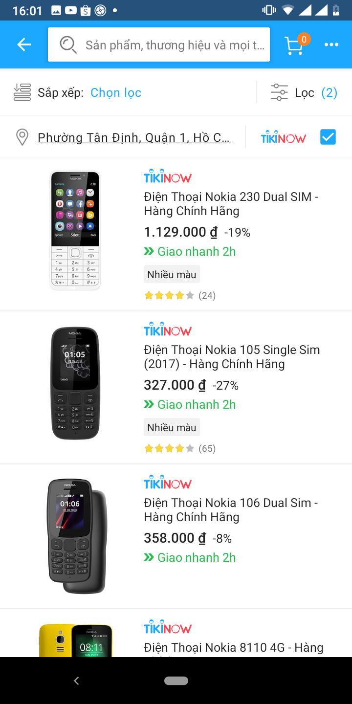

# Home Test

Create a simple Android project. Call api to get list of products then display as design:

 

Resources:

 * API: [products.json](https://raw.githubusercontent.com/tikivn/android-home-test/v3/products.json)
 * Icons: can be found in this repository.
   * 
   * 

PS: 

 * Upload your submission to Github then send the link.
 * If you have any questions please send email to <giang.nguyen@tiki.vn> for answers.
